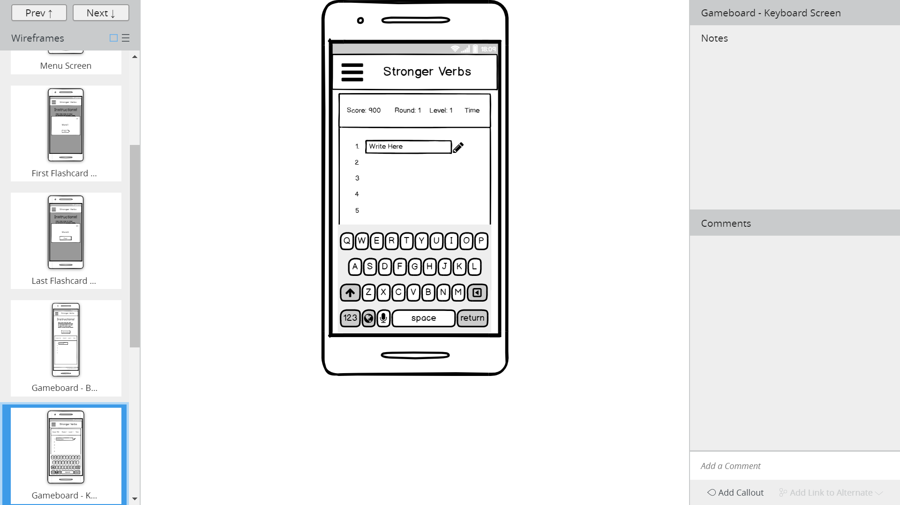

#Milestone Project 2 - Interactive Frontend Development

##Project Description
The objective of this project was to design a pattern-based memory game using HTML, CSS and JavaScript. 
The type of patterns used were lists of words (specifically verbs) that the player must memorise and reproduce in the correct order.
The game is designed to stengthen the player's writing abilities, as being able to recall verbs easily and readily is a simple, effective 
way to produce strong sentences and more memorable literary works. There are 10 levels to each round of the game and points are awarded
for each correct answer. Initially, the player is required to recall three words. After each successful level, two more words are added
to the list until a total of 21 words must be memorised.

##UX
###Layout

###Colour Palette
As the target audience is writers, the colours resembling parchment (off-white) and ink (blues and black) were the main colour theme 
for the game.

###Images
For the background of the jumbotron on the home screen, an image of a fountain pen was chosen to keep with the writing theme. 
A photo of parchement was used for the surface of the gameboard and a photo of a bookcase was the background of the gameboard.

###Fonts
The concept of the fonts was to mimic the writing process - going from hand writing to printed words.
For the input field in the game, Tangerine was chosen for its calligraphy style. The correct, printed word on the gameboard
was the font'Nixie One'. The headings on the modals and navbar was the font 'Fredericka the Great', again for its visual link 
to writing.

###User Journey

##Features
###Current Features

Landing Page - 
Instructions Modal - 
Flashcard Modal - 
Gameboard - 

###Future Features
Option to select difficulty mode - A timer will be added, allowing the player a set amount of time to recall the word. 
Easy will have no time restrictions. Medium will have 60 seconds per word. Hard will have 15 seconds per word.

##Bugs
An identified bug that could not be rectified in time for the deployment of this website was when enter key was used to submit 
answers in levels 2 and above. When the answers are submitted by clicking the button, there was no issue. But using the enter key
resulted in a second blank answer being submitted as well. This bug would be corrected in future versions of the website.

##esting
The css stylesheet was inputted directly into the W3C CSS validator and approved. The HTML index.html was inputted directly into the W3C Markup validator. Errors and warnings for each page were addressed and then the page was rechecked through the validator. The process was repeated until no warning remained. The html files and the css stylesheet have been validated.

Manual testing was carried out on all the buttons and the both the Check button and enter key was used to submit answers in the game. The enter created issues when used on levels 2 and above. It was not possible to fix this particular bug prior to deployment.

Both correct and incorrect answers were submitted to confirm that the appropriate icon and messages were displayed. All tests passed, with spacing on the screen as the only issue when words were too long.

Answers in uppercase were also submitted to verify that the .toLowerCase() function was working correctly. This test passed.

Answers containing numbers and non-letter characters were also tested. They returned the expected incorrect text response.

The Level Modal was tested by manually finishing level 1 and level 2. The modal displayed (passed) and buttons and linked functions passed.

The Round Modal (which displays when the player has completed level 10) was triggered to display. The modal displayed and all buttons worked as designed.

Automatic testing was not carried out prior to deployment due to time constraints. But preferrably, the following would be tested automatically: 

- A correct answer submitted in lowercase - expect a green icon
- An incorrect answer - expect red text response
- A correct answer submitted in uppercase - expect a green icon
- Answer containing numbers and non-letter characters - expect red text response
- Comparing the current game level to the number of words displayed on flashcards - expect number of words to be (level*2)+1</li>
- Comparing the current game level to the number of word spaces displayed on gameboard - expect number of spaces to be (level*2)+1</li>

The website was inspected using Google Chrome Dev Tools to view it on mobile and tablet versions. The page and each modal was viewed and tested in these views.

##Deployment of Website

This webiste was developed using gitpod and stored in repositories on Github. Gitpod was installed as an extension tool on 
google Chrome, which was accessed then via the project's repository page on Github. This allowed for regular version control 
updates:
1. git add . was entered into the command line interface to add files to the staging area.
2. git commit -m "" committed the files to the repository.
3. git push -u origin master pushed the master branch.

The website was deployed using Github Pages. To do this, while in the github webpages of the project repository, I accessed
 the Settings Tab. Under the GitHub Pages section further down the page, is the option to choose Source. I switched the 
 default option of none to master branch. Then I retrieved the provided link to my deployed website.

Link to Deployed Website: 

To run the project locally:

1. Follow the link below to the project's Github repository page.
2. Click on Clone or Download.
3. Copy the link provided.
4. Enter git clone into the command line interface.
5. Paste in the copied link and press enter.

##Technology
1. GitHub was where the files were stored.
2. Gitpod was the editing environment used to create and edit files.
3. Bootstrap 4 was used for navbar, forms and for its grid system to improve responsive design.
4. Font awesome was used to provide icons.
5. The photos were taken using a Oneplus 6T phone and edited using the phone's build-in photo software.
6. Google Fonts was used to provide the fonts.
7. Colors was used to generate a color palette.
8. W3C CSS Validator was used to validate the style.css file.
9. W3C Markup Validator was used to validate the following files: index.html.
10. HTML Formatter was used to format the following files: index.html.

##Credit
- Thanks to Reuben Ferrante for advising as mentor on this project.
- The code used in the construction of the navbar was obtained from the Code Institute "Whiskey Drop" tutorials.
- The code used to style the social links in the footer of all the webpages, came from Code Institute's mini-bootstrap (resume project) tutorial.
- The inspiration for and part of the code used for the timeline/navigation feature in the footer came from Code Institute's mini-bootstrap (resume project) tutorial.
- The css code structure for the jumbotron and contact form buttons were modelled on the Facebook Sign up button (for the 3D effect).